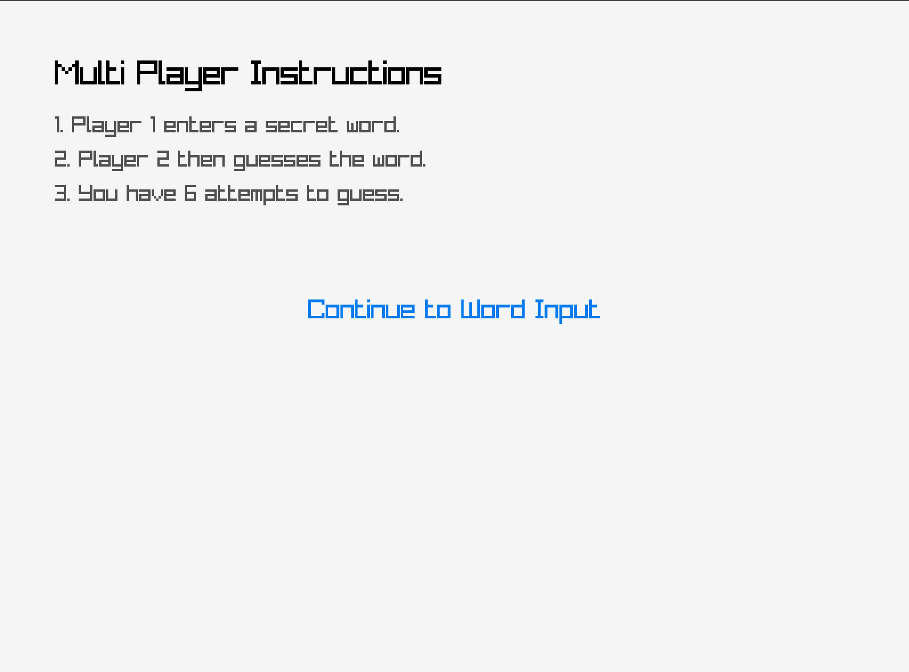
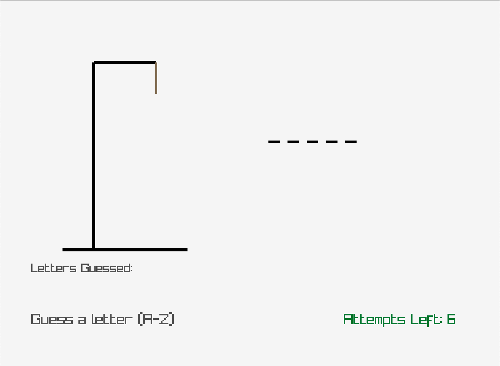

# Guess the Word – Hangman Game

Guess the Word is a Hangman-style word guessing game themed around animal names. This project comes with two versions:

🖼️ Visual Version using C + Raylib

💻 Console Version using standard C

You can play in Single Player (with random animal names) or Multiplayer (one player inputs a word, the other guesses it).

## Screenshots (Visual Version)

| Start Screen | Mode Selection | Single Player Instructions |
|--------------|----------------|-----------------------------|
|  |  |  |

| Multiplayer Instructions | Multiplayer Input | Gameplay |
|--------------------|-------------------|---------------|
|  |  | 

---

## Game Modes

🧍 Single Player
Guess random animal-themed words with up to 6 wrong attempts.

👥 Multiplayer
Player 1 inputs a word (kept secret), and Player 2 tries to guess it.

## How to Compile & Run

- Visual Version (Raylib GUI)
Linux / macOS
```bash
gcc guessword.visual.c -o guess_word_game $(pkg-config --cflags --libs raylib)
./guess_word_game
```
Windows (MSYS2)
bash
Copy
Edit
gcc tebakkata.visual.c -o guess_word_game -lraylib -lopengl32 -lgdi32 -lwinmm

- Console Version (Non-GUI)
All Platforms (with GCC)
```bash
gcc guessword.visual.c -o guess_word_game -lraylib -lopengl32 -lgdi32 -lwinmm
```

## Game Flow

1. **Start Screen**
2. **Mode Selection**
Select:
- Single Player → guess random animal-themed words
- Multiplayer → Player 1 enters a word, Player 2 guesses
3. **Instructions**
4. **Gameplay**
Guess the letters A–Z. Maximum 6 errors.
5. **Game Over**
- Win: all letters guessed successfully
- Lose: hangman finished drawing

## Features
**Both Versions**
- Single Player: Random animal-themed words

- Multiplayer: Manual word entry

- Max 6 incorrect guesses

- Case-insensitive guessing

- Replayable after win/loss

**Visual Version (Raylib)**
- GUI with keyboard/mouse support

- Full Hangman drawing visualization

- Custom font support (resources/custom_font.ttf)

- Smooth screen transitions

**Console Version**
- Fully playable in terminal

- Clear screen transitions and structured menus

- Display of remaining lives with symbols


## Project Structure

```
.
├── tebakkata.c              # Console version (terminal-based)
├── tebakkata.visual.c       # Visual version using Raylib
├── screenshots/             # Game screenshots
│   ├── start.png
│   ├── mode.png
│   ├── singleplayer_instructions.png
│   ├── singleplayer_guess.png
│   ├── multiplayer_instructions.png
│   └── multiplayer_input.png
├── resources/
│   └── custom_font.ttf      # (Optional) Custom font for visual version
└── README.md

```

## Font

Custom fonts can be used with the file:

```
resources/custom_font.ttf
```

If not available, it will be automatic fallback to Raylib's default font.

## Dependencies

- [Raylib](https://www.raylib.com/)
- C Compiler (GCC/Clang)

**For Visual Version**
- Raylib
- C Compiler (GCC / Clang)

**For Console Version**
- C Compiler (GCC / Clang)

## Raylib Installation

**macOS:**

```bash
brew install raylib
```

**Ubuntu/Debian:**

```bash
sudo apt install libraylib-dev
```
**Windows (MSYS2):**

```bash
pacman -S mingw-w64-x86_64-raylib
```

## Notes

- Temporary files like `tempCodeRunnerFile` are **best avoided** in repositories.
- Use `.gitignore` to exclude them automatically.

## Author

Created by [@akmalhen](https://github.com/akmalhen)
