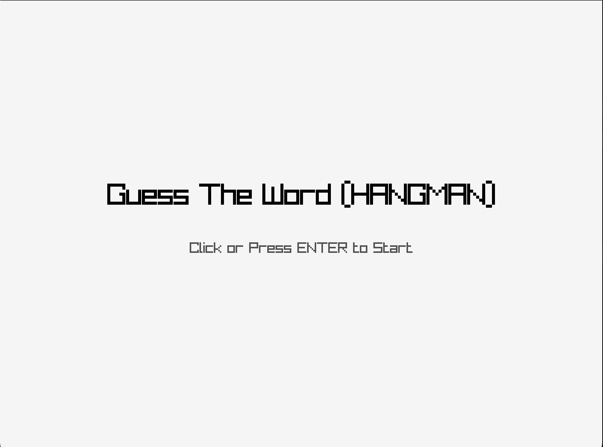
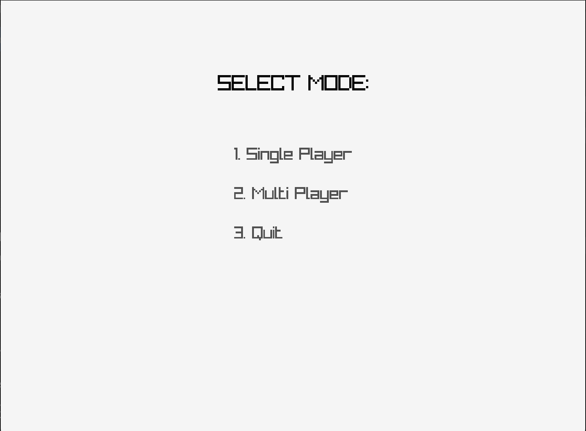
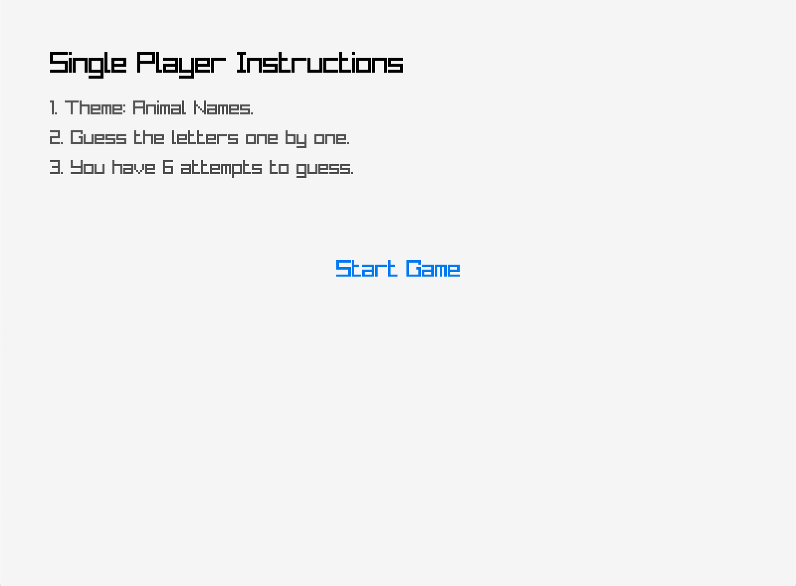
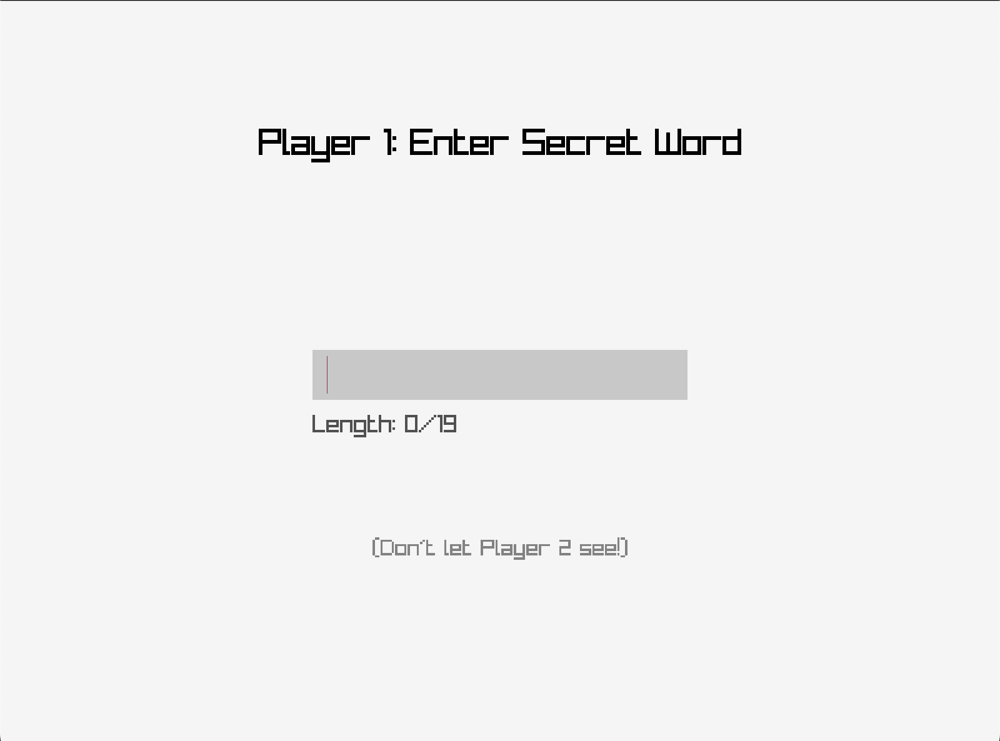
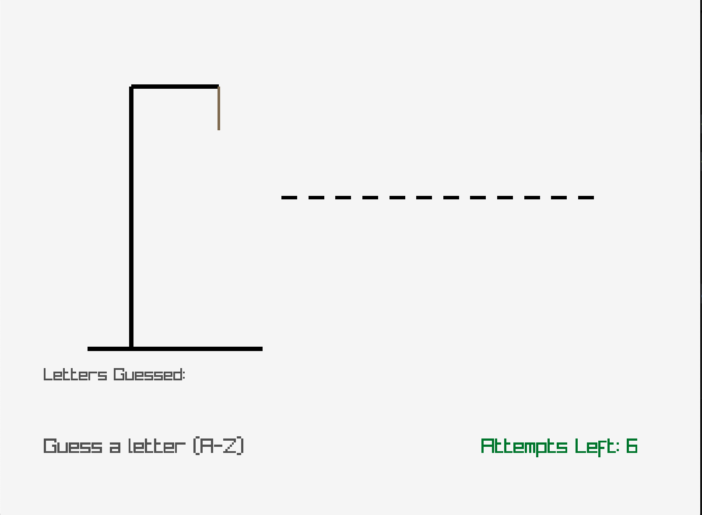

# Guess the Word Visual Game (Hangman)

Guess the Word is a simple Hangman game themed **animal names**, made using **C and Raylib**. This game supports **Single Player** and **local Multiplayer**.

## Screenshots

| Start Screen | Mode Selection | Single Player Instructions |
|--------------|----------------|-----------------------------|
|  |  |  |

| Multiplayer Instructions | Multiplayer Input | Gameplay |
|--------------------|-------------------|---------------|
|  |  |

---

## Compile & Run

### Linux / macOS

```bash
gcc guessword.visual.c -o guess_word_game $(pkg-config --cflags --libs raylib)
./guess_word_game
```

### Windows (MSYS2)

```bash
gcc guessword.visual.c -o guess_word_game -lraylib -lopengl32 -lgdi32 -lwinmm
```

## Game Flow

1. **Start Screen**
2. **Mode Selection**
Select:
- 1 Single Player → guess random animal-themed words
- 2️ Multiplayer → Player 1 enters a word, Player 2 guesses
3. **Instructions**
4. **Gameplay**
Guess the letters A–Z. Maximum 6 errors.
5. **Game Over**
- Win: all letters guessed successfully
- Lose: hangman finished drawing

## Features

Single Player with random animal-themed words

Multiplayer: manual word input by Player 1

Full hangman visualization

Interactive GUI with Raylib

Keyboard and mouse support

Screen view between stages

## Project Structure

```
.
├── guessword.visual.c # Main source code
├── screenshots/ # Folder containing game screenshots
│ ├── start.png
│ ├── mode.png
│ ├── singleplayer_instructions.png
│ ├── singleplayer_guess.png
│ ├── multiplayer_instructions.png
│ └── multiplayer_input.png
├── .gitignore
└── README.md
```

## Font

Custom fonts can be used with the file:

```
resources/custom_font.ttf
```

If not available, it will be automatic fallback to Raylib's default font.

## Dependencies

- [Raylib](https://www.raylib.com/)
- C Compiler (GCC/Clang)

### Raylib Installation

**macOS:**

```bash
brew install raylib
```

**Ubuntu/Debian:**

```bash
sudo apt install libraylib-dev
```

## Notes

- Temporary files like `tempCodeRunnerFile` are **best avoided** in repositories.
- Use `.gitignore` to exclude them automatically.

## Author

Created by [@akmalhen](https://github.com/akmalhen)
